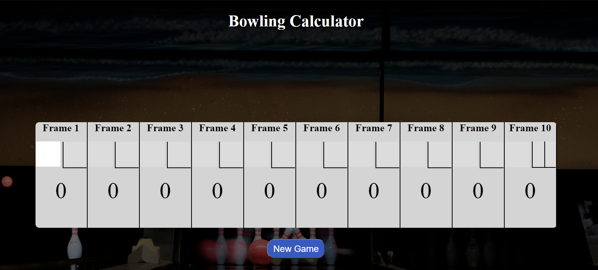
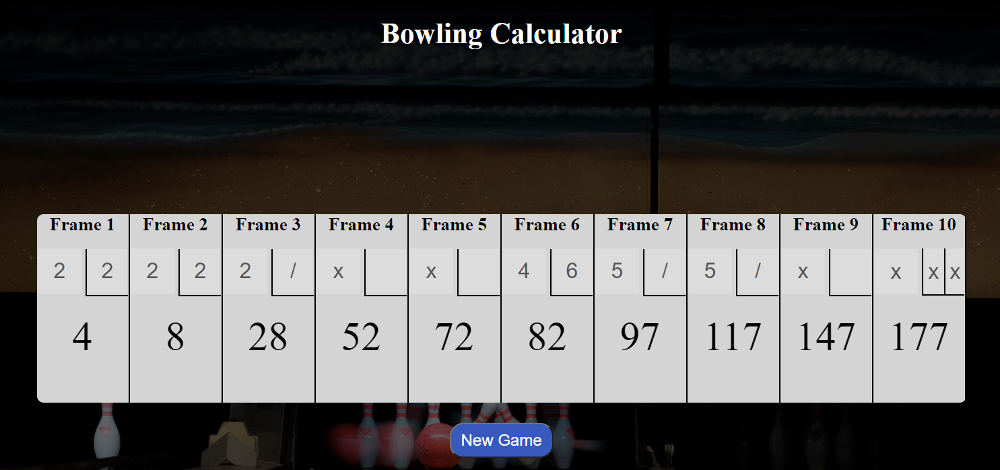

# BowlingCalculator

This bowling calculator lets you enter in the scores of each frame. As each score is entered in the score will update accordingly.

# Project Rules

With this project there was a few things that you have to keep in mind. When the user bowls a spare their score is not recorded for that frame until
they have rolled one more time. When the user roles a strike the score is not counted until the user rolls their next 2 roles. If the user knocks down less then 10 pins per
frame, then the score is counted up and added to the total for that frame.

# Languages used

HTML,CSS, and JavaScript

# Things learned

When I first started working on this project I thought it would be easy but after diving in to it I realized that it was a little more complicated then I originally thought. I learned
a more in-depth knowlege of object-oriented-programming in JavaScript.

# Live Version

You can vist the live version of this site at https://combeecreations.com/bowling/
